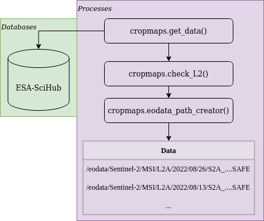

# cropmaps

MAGO `cropmaps` package is an open source Python toolbox for crop type mapping
from Sentinel-2 L2A multispectral satellite data using two well known machine learning
algorithms; SVM and Random Forest.

## Installation using `pip`

Use ```git``` command to get ```cropmaps``` package and then ```pip``` package manager to install the module. 

```bash
git clone ...git && cd cropmaps/
pip install .
```

##  Quickstart

### Importing Python dependencies

For this software to run user must import in Python the following packages:

```python
import os
import numpy as np
import rasterio
from cropmaps.sts import sentimeseries
from cropmaps.get_creodias import get_data, check_L2, eodata_path_creator
```

### User required information

User must define for the software:

- A path to an area of interest (AOI) must be defined by the user for the software to be able to search for data in a specific region.
The path must be provided in Python as a ```str```.
- ESA-Scihub credentials are required in order to perform requests to ESA while searching for data. If you do not
have you can create an account [here](https://scihub.copernicus.eu/dhus/#/self-registration). ESA-Scihub credentials
must be provided in Python as a ```str```.
- At last, a search/work time slot must be provided by the user. The date format is ```YYYYMMDD```
and provided in Python as a ```str```.
For all the above see the following Python lines:

```python
AOI = "/home/eouser/uth/Cap_Bon/AOI/AOI.geojson"

user = "****"
password = "****"
start_date = "20210910"
end_date = "20220910"
```

### Get data

The first step in order to find all the available Sentinel-2 data is to use the above variables (```user, password, start_date, end_date```) to get as a ```Pandas DataFrame``` all the Sentinel-2 catalog. In the example bellow only two query variables are used, ```producttype``` set to ```S2MSI2A``` and ```cloudcoverpercentance``` is set to 0-5% (```"[0 TO 5]"```).

> :memo: User can define more variables for a more specific query. These variables can be found [here](https://scihub.copernicus.eu/twiki/do/view/SciHubUserGuide/FullTextSearch?redirectedfrom=SciHubUserGuide.3FullTextSearch).

<div align="center">

</div>

Then the result from query is being tested using ```check_L2``` method since the resulted Sentinel-2 data must be in atmospherically corrected L2A.
The last step of the following chunk is to use the ```eodata_path_creator``` method for getting the respective data paths in CreoDIAS.

```python
# Check here for more: https://scihub.copernicus.eu/twiki/do/view/SciHubUserGuide/FullTextSearch?redirectedfrom=SciHubUserGuide.3FullTextSearch
data = get_data(AOI, start_date, end_date, user, password, producttype = "S2MSI2A", cloudcoverpercentage = "[0 TO 5]")
data = check_L2(data)
creodias_paths = eodata_path_creator(data)
```

### Create CreoDIAS local storage structure

All the available data in CreoDIAS are stored in ```/eodata```
folder. Users do not have editing/writing permissions in that specific folder. So the user have to use the following lines of code to create a local folder to store the results of the procedure that will follow.
Note that the original data will not be copied in user's local folder but only new products such as NDVI, or masked images will only be saved there.

```python
# Reproducing a DIAS enviroment where we can not write inside the data folder from the moment we have the data
# This step is required because there are no permissions to write inside the /eodata DIAS folder
products_path = "/home/eouser/uth/eodata_local"
if not os.path.exists(products_path):
    os.makedirs(products_path)
```

To get the data in Python the user has to use ```find_DIAS()``` method and the ```creodias_paths``` variable from the above steps. Method find_DIAS() is part of cropmaps.sts.sentimeseries class which is responsible to collect, process and analyze Sentinel-2 timeseries data. For more information see [here](under construction).

```python
# Create a timeseries with all the available data from query
eodata = sentimeseries("S2-timeseries")
eodata.find_DIAS(creodias_paths)
```

### Keep data with specific relative orbit 

Using the same instance of sentimeseries object named above as eodata the user can sort and remove data using date and a relative orbit using the following chuck of code. In this specific example the user sorts the data using date and then keeps only the data with relative orbit 122.

```python
# Keep only images with specific orbit 122
# Over the region of interest there are two available orbits the the one contains missing data
eodata.sort_images(date=True)
unique_orbits = list(set(eodata.orbits))
print(f"Orbits: {unique_orbits}")
unique_orbits.remove("122")
to_be_removed = unique_orbits
for orbit in to_be_removed:
    eodata.remove_orbit(orbit)
```

### Masking data using AOI file

In this example the region of interest is a cover a smaller geographical region than the available Sentinel-2 data. To save disk space and computational time, raw data must be masked to the geographical cover of the AOI. Also, it is important to have all the raster data in the same spatial resolution and for that in the example bellow the highest possible resolution of 10 meters for Sentinel-2 was selected.

| Band | Resolution (m) | Resize | Final Resolution |
|------|----------------|--------|------------------|
| 02   | 10             | False  | 10               |
| 03   | 10             | False  | 10               |
| 04   | 10             | False  | 10               |
| 05   | 20             | True   | 10               |
| 06   | 20             | True   | 10               |
| 07   | 20             | True   | 10               |
| 08   | 10             | False  | 10               |
| 8A   | 20             | True   | 10               |
| 11   | 20             | True   | 10               |
| 12   | 20             | True   | 10               |
-----------------------------------------------------
Table 1: Bands with their respective raw spatial resolution and the final spatial resolution

```python
# Mask the data and resize them to 10m resolution to match the highest possible resolution
eodata.clipbyMask(shapefile = AOI, store = products_path) # Raw Clipping
eodata.clipbyMask(shapefile = AOI, store = products_path, resize = True) # Resize 20m to 10m

# If you want to perform the analysis on less bands just add the band name to the band argument
# as in here: eodata.clipbyMask(shapefile = mask, store = products_path, band = "B05", resize = True)
```

### Calculate Vegetation and RS Indices

For the crop type mapping with remote sensing data is important the use of vegetation/RS indices. Currently, the software supports the calculation of 3 indices: NDVI, NDWI and NDBI. NDVI and NDWI raw spatial resolutions are 10 meters, while NDBI's raw spatial resolution is 20 meters. In NDBI's case upsampling procedure must be performed to match the required spatial resolution of 10 meters. 

```python
# Calculate vegetation indexes
eodata.getVI("NDVI", store = products_path, subregion = "AOI") # Subregion is the name of the mask shapefile
eodata.getVI("NDWI", store = products_path, subregion = "AOI")
eodata.getVI("NDBI", store = products_path, subregion = "AOI")

# Do the same for the vegetation indexes
# NOTE: CLIPPED DATA BY DEFAULT ARE SAVED AS AN ATTRIBUTE OF THE S2IMAGE OBJECT AS image.BAND[RESOLUTION][MASK_NAME]
# SO IN THIS CASE TO ACCESS THE ATTRIBUTE OF IMAGE 0, BAND B12 YOU CAN write: eodata.data[0].B12["10"]["AOI"] 
eodata.upsample(store = products_path, band = "NDBI", subregion = "AOI")
```

### Training/Predicting ML-model for crop type mapping using Sentinel-2 timeseries data

#### Importing required Python packages

```python
from cropmaps.cube import generate_cube_paths, make_cube
from cropmaps.models import random_forest_train, random_forest_predict, save_model, LandCover_Masking
from cropmaps.prepare_vector import burn
```
#### Creating hypercube for training

The first step for making the training hypercube is the selection of bands to be included. Note that all the available dates of the ```eodata (sentimeseries object)``` will be used. Then the use of ```generate_cube_paths()``` method is used to provide all tha data paths of the images to be stacked. At last the user must provide a hypercube name and call the ```make_cube()``` method to create and save the hypercube.

```python
# Get the paths of all available data for making the cube
bands = ["B02", "B03", "B04", "B05", "B06", "B07", "B08", "B8A", "B11", "B12", "NDVI", "NDWI", "NDBI"]
paths = generate_cube_paths(eodata, bands, mask = "AOI")

# Create the cube
cube_name = "cube"
cube_path = make_cube(paths, products_path, cube_name, dtype = np.float32)
```

#### Prepare Ground Truth (GT) data for training/testing

For the training/testing of the model GT data must be used. The raw format of the GT data must be in ESRI Shapefile.
Any valid Coordinates Reference System (CRS) can be used on that data. User must provide a ```shapefile``` variable with the path to the data and the respective class column.
The data then must be converted from vector to raster. For that, user must provide metadata, such as CRS, transform, pixel size etc as a Python `dict`.
These type of information can be extracted by copying the metadata information of any NDVI image as in the example bellow.

> :warning: The spatial resolution of the GT raster must be the same with the spatial resolution of the hypercube!

The last step is the usage of ```burn()``` method to write the GT data as an image with the same metadata as the cube. 

```python
# Prepare training ground truth data
shapefile = "/home/eouser/uth/Cap_Bon/Ground_Truth/GT_data_selected_balanced.shp" # Shapefile of the vector training data
classes = "Crop" # Name of the column with the crops
base_path = eodata.data[0].NDVI["10"]["AOI"] # Path of a base image to burn
metadata = rasterio.open(base_path).meta.copy() # Copy metadata dictionary to save the image using the same CRS, transform, shape etc
gt_data_raster = burn(shapefile, classes, metadata) # Save the ground truth data as raster
```

#### Training ML-model

For the training of the model ```random_forest_train``` method is being used by providing the hypercube path, the GT raster data path and a path to store the results. By default the 70% of the available GT data is used for the training of the model and 30% for testing. Also the user can save the model as in the example bellow using the ```save_model()``` method. 

```python
# Train the model using the cube and the burned raster image with the ground truth data
model = random_forest_train(cube_path = cube_path,
    gt_fpath = gt_data_raster, 
    results_to = "/home/eouser/uth/Cap_Bon/")

saved_model = save_model(model, spath = "/home/eouser/uth/Cap_Bon/") # Save model to disk
```

#### Classification with the ML-model

The final step, is the usage of the model to classify the hypercube in the AOI. For this the ```random_forest_predict()``` method is being used.
Also since only crops are required,  ESA-CCI Landcover external product is being used to mask generated product where non-vegetation categories exist.
 
```python
classified = random_forest_predict(cube_path = cube_path, model = model, results_to = "/home/eouser/uth/Cap_Bon/") # Use the model to predict over the cube


landcover_data = "/home/eouser/uth/Cap_Bon/LandCover" # Path to store LandCover data
landcover_image = eodata.LandCover(store = landcover_data) # Download ESA worldcover data

classified = LandCover_Masking(landcover_image, classified, results_to = "/home/eouser/uth/Cap_Bon/") # Mask the result using the third party LandCover product
```